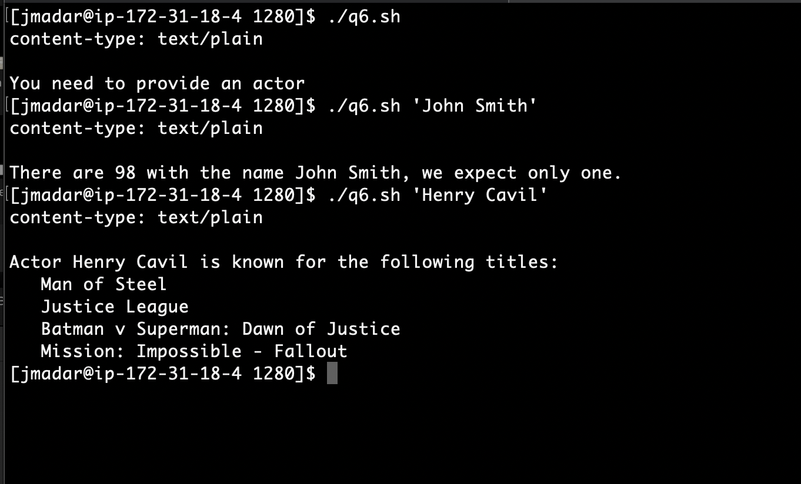
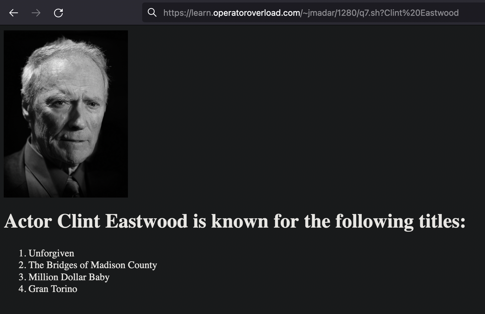
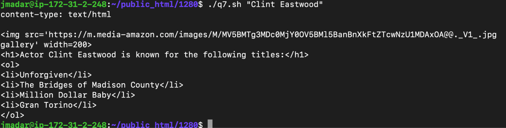

# Introduction

Bash scripts can be called by a special URL on a web server.

For this assignment, put all your scripts inside
the `/usr/lib/cgi-bin/web-admin-cgi-scripts/` directory.

## NOTES

You will need to use sudo for some of the commands because you will be writing
files / creating links in privileged areas of the filesystems.  Make sure you
review sudo and the file systems from the follow videos (optional but good to
know):

  - https://ww.linkedin.com/learning/learning-linux-command-line-2/user-roles-and-sudo?u=57075641

  - https://www.linkedin.com/learning/learning-linux-command-line-2/the-linux-filesystem?u=57075641

  - The most important directory is `/usr/lib/cgi-bin/`.  If you put an executable file here,
    it can be called from the web via `http://${your_server_ip}/cgi-bin/<script file name>`

  - Put your work inside the `/usr/lib/cgi-bin/web-admin-cgi-scripts/` directory

  - Your script can be accessed by anyone on the Internet!!!
    
  - For scripts to be runnable by the web server, the output requires a couple of special lines.
    Below is the example script:

    ```
    #!/bin/bash
    # need to start with a line identifying the output mime type
    # this is part of the HTTP response header
    echo "content-type: text/plain"

    # an empty line to indicate the end of header and the start
    # of the content
    echo 

    # you can now write the rest of your script below
    echo "Hello World"
    ```
    
  - For additional technical information on CGI scripts, you can read the official
    Apache documentation at  https://httpd.apache.org/docs/2.4/howto/cgi.html#writing.
    Start at the section labeled "writing" as all the steps before have already been set up.

  - It's important to learn how to read official software documentation as there will be
    times during your software engineering career when no tutorials are available!

# Question 1

If you follow my instructional video (https://www.youtube.com/watch?v=KyN0DTeSE8A),
you would have successfully created test.sh.  Rename it to `q1.sh` and move it inside
**`/usr/lib/cgi-bin/web-admin-cgi-scripts/q1.sh`**

For q2 to q7, you will be writing scripts that are executable on your web server.
For example, we should be able to run your script by visiting:

```
curl http://<your ip>/cgi-bin/web-admin-cgi-scripts/q[1-7].sh
```

NOTE:  For the rest of the questions, I have also provided a running version so you can test
your against the answer key.  However, you are not allowed to use my script in your answer
(i.e. by doing a curl to my scripts)

# Question 2

Write a script called q2.sh that will tell the visitor a random joke.  The
output of this script can be found at http://learn.operatoroverload.com/~jmadar/1280/q2.sh
so you can check your output to see if it is correct.

You can get a new joke by doing a curl on https://icanhazdadjoke.com.  i.e.

```
$ curl https://icanhazdadjoke.com
What did the pirate say on his 80th birthday? Aye Matey!
```

HINT: The answer to this question is very simple.  When q2.sh is called, your
script will simply make a call to icanhazdadjoke.com and return the result.  

# Question 3

Write a script q3.sh that retrieves all slugs from the current time.com home page but display they as
titles (i.e. remove all dashes).

You can access the JSON data for time.com at https://time.com/wp-json/wp/v2/posts/?per_page=10&context=embed
I only want the slugs, not the entire URL.

A couple of things to note:

  - To retrieve the data that made up of a reddit page, use the following command:
  
    ```
    curl -s https://time.com/wp-json/wp/v2/posts/?per_page=10&context=embed | json_pp
    ```

  - A running version of the script can be found at
    https://learn.operatoroverload.com/~jmadar/1280/q3.sh

# Question 4

Just like the command line, you can pass arguments into your script running on a web
server using the following scheme.  Assuming you have a script called test.sh:

http://<your ip>/cgi-bin/test.sh?arg1

Will pass the string arg1 into your script as $1 variable.

Create a script q4.sh by modifying q3.sh, where users can provide an argument to
specify how many slugs to show. The script will return all the titles on that
subreddit.  For example:

http://learn.operatoroverload.com/~jmadar/1280/q4.sh?20 will return 20 slugs from time.com

If no argument is provided, output an error message 
You can use http://learn.operatoroverload.com/~jmadar/1280/q4.sh to see the
intended output of your script.

# Question 5

Check out http://learn.operatoroverload.com/~jmadar/1280/q5.sh?dog.  It returns the
bing search result of ‘dog’.  The actual call to bing is performed via curl
within my script! 

To achieve this yourself, your script will need to do the bing search on
behalf of the user. The key observation is that you can provide a search
term as part of the URL as follows https://wwww.bing.com/search?q=${SEARCH_TERM}

You can prove this by issuing the following curl command on the terminal:

```shell
$ curl https://wwww.bing.com/search?q=dog
```

Create a script q5.sh that behaves like
http://learn.operatoroverload.com/~jmadar/1280/q5.sh, where when provided a
parameter, it will perform a google search and return the result.

NOTE: since HTML is returned from google, you will need to set the content-type
to be ‘text/html’ in your script.  Otherwise the browser won’t display the
search result properly.

So why do this?  When you do a search on google, google will keep track of your
search history, preferences, etc. by keeping track of your IP, browser login, etc.
What we are doing here is have your web server do the search on behalf of you.
This way google doesn’t know who is actually doing the search as all searches will
appear to come from the web server.  This is the primary idea behind various
VPN technologies.

# Question 6

Note: getting more challenging

The Internet Movie Database (IMDB) has all their data available for the public
to download, the dataset explanation is at https://www.imdb.com/interfaces/ and
the download location can be found at https://datasets.imdbws.com/ 

For this exercise, you’ll first need to download and decompress
name.basics.tsv.gz and title.basics.tsv.gz files onto your server.

These are “tab separated files” (tab being the delimiter between fields).
The name.basics.tsv contains the names actors, directors, etc. while
titles.basics.tsv contains information about a specific title.

Your job is to write a script, q6.sh, that takes in an actor or actress’s name
as input, and outputs all the movie titles that the actor is known for.  If
more than one actor matches, a message will display telling the user that the
script expects only one actor or actress to match.  Take a look at this script
in action on the command line:



Make sure this script can be called via your web server.  You can test it at
http://learn.operatoroverload.com/~jmadar/1280/q6.sh

Q7
WARNING:  This question is a lot of work but worth very little compared to the rest
of the assignment.  It may not be worth your time and is only here to provide additional
challenges for those who are ready for it.  Don’t feel bad if you want to skip this!!

q6.sh is a lot of fun, and there are many enhancements that you can make.  For this
question, first make a copy of your q6.sh and call it q7.sh, then perform the following:

Change the content-type to text/html, and format the output
in HTML, along with including the actor’s image in the output.  HINT: noticed that the url
https://www.imdb.com/name/nm0147147/ retrieves information about the actor by it’s id.

Here’s a running version of q7.sh.



Running from the command line:



You can test it using this url: http://learn.operatoroverload.com/~jmadar/1280/q7.sh 

# Hand-in

If you followed all the instructions above, you would have the following files in the
`/usr/lib/cgi-bin/web-admin-cgi-scripts/` directory:

```
/usr/lib/cgi-bin/web-admin-cgi-scripts/
├── q1.sh
├── q2.sh
├── q3.sh
├── q4.sh
├── q5.sh
├── q6.sh
├── q7.sh
└── title.basics.tsv
```

Clone the assignment repo into your ${HOME} directory, then
execute `pytest` in the `${HOME}/${ASSIGNMENT_REPO}/` to
check if you got everything correct.

When you are satisified, run the following commands to submit:
   - `git add -A`
   - `git commit -a -m 'submit'`
   - `git push`
   
